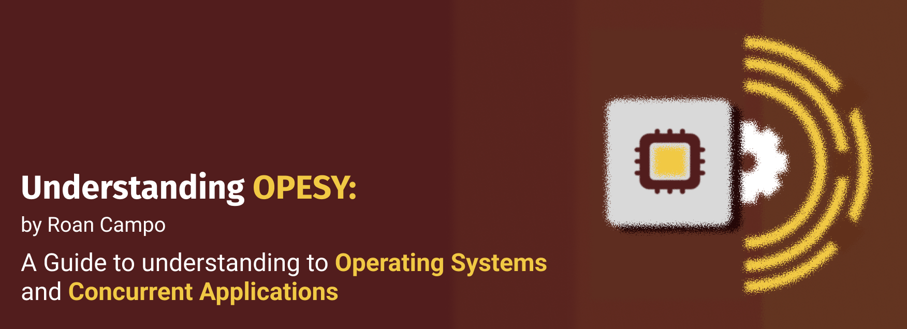

<p align="center">
  
  
  
  
  
</p>

# Understanding-CSOPESY

 A collection of notes for understanding Operating Systems and Concurrency.

## Overview

This repository contains concise notes and documents related to Operating Systems concepts, including process management, memory management, file systems, and multi-threading. It is intended as a resource for students and professionals seeking to deepen their understanding of core OS principles and practical implementation details.

Topics covered include:

- [X] Thread fundamentals
- [X] Synchronization and concurrency
- [x] Design Patterns
- [ ] Memory allocation and management
- [ ] File systems and storage
- [ ] Scheduling algorithms

Feel free to explore the notes and contribute improvements or additional topics.

## Getting Started

To get started with this repository:

1. **Clone the repository:**

   ```sh
   git clone https://github.com/ImaginaryLogs/Understanding-CSOPESY.git
   cd Understanding-CSOPESY
   ```

2. **Browse the notes:**

   - Open the Markdown files in your preferred editor (such as VS Code).
   - Each topic is organized in its own folder or file for easy navigation.

3. **Contribute:**

   - Fork the repository.
   - Create a new branch for your changes.
   - Submit a pull request with your improvements or additions.

4. **Requirements:**

   - No special software is required to read the notes.
   - For code samples, ensure you have a C++ compiler (e.g., `g++`) if you wish to compile and run examples.

## Contacts

For questions, mistakes, or feedback, feel free to reach out via:
