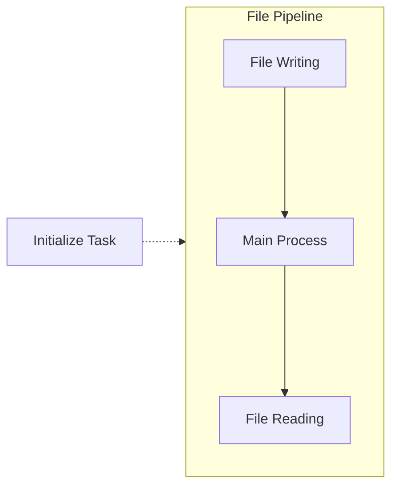
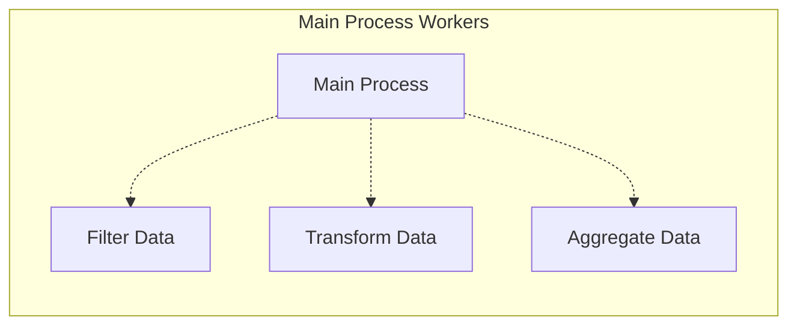
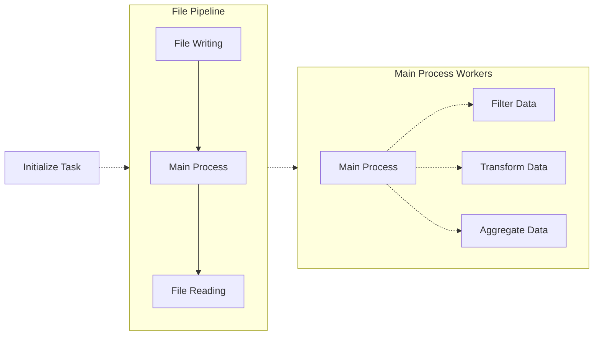
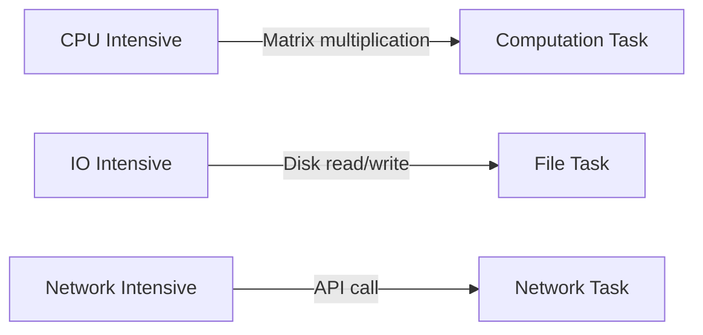
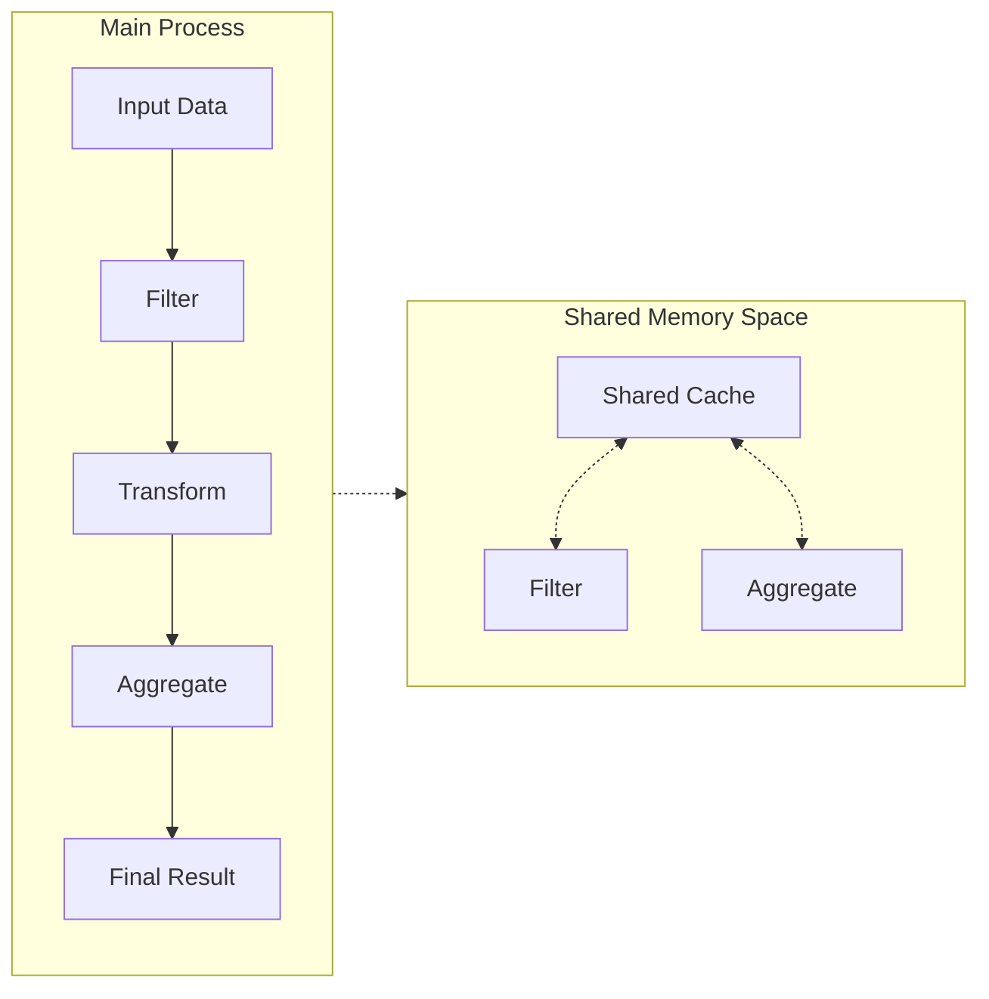
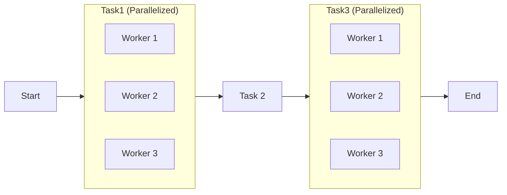

High Level Design

It identifies _what needs to be done_ and _how tasks relate to one another_, without getting into the exact implementation yet.

### Task Decomposition

Breakdown problems into smaller tasks that can be done *asynchronously* or in *parallel*. This allows you to spot independent work that can execute simultaneously.

In this general example below of a solution, reading and writing the necessary raw results are necessary sequential steps and can be done asynchronously from processing the data. 



Processing data may be able to be work on simultaneously by different threads. It can require some filtering, transforming, or some aggregating. 




In a holistic view, you may view it like this for example.



This can be further broken down until tasks are considered **atomic** to the designer.

>[!example] Web Crawling
>```mermaid
>graph LR
>	main-->W1[Web crawler 1]
>	main-->W2[Web crawler 2]
>	main-->W3[Web crawler 3]
>	W1--->Writer
>	W2--->Writer
>	W3--->Writer
>```
> For example, a web crawler application might benefit from having multiple threads search through multiple website URLs to **increase the work done**.

### Resource Requirements

List down CPU resources that are necessary for a task to use. These can influence what is the design architecture is to be used to solve this task.



By listing down CPU resources needed, it can influence what kind of design pattern you need to solve it.

Network Intensive and IO-intensive task for disk writing can be labelled as **synchronous**.

If a tasks require multiple various resource requirements, that may be a sign that you need to *breakdown* the task further into smaller **atomic** threads.

### Data Dependencies

Map out what kind of data is required by a task. Identifying data requirements help list out what data needs to be shared throughout tasks or to be passed locally.



Here, in this general example. Filter and Aggregate require the same memory. Thus, you can **explicitly identify** some sort of interthread communication between them or design shared memory.

Perhaps here, some sort of queue-based messaging may work for example.

### Control Flow Analysis



Use **Directed Acyclic Graphs** (DAG)s to identify bottlenecks and potential ways to create parallelism. Visualize control flow with graphs to intuitively get the flow of information.

Here you can see that Task 2 is the **bottleneck** in the design, so effort must be placed to make Task 2 efficient to handling any work sent from Task 1 and work sent to Task 3.
