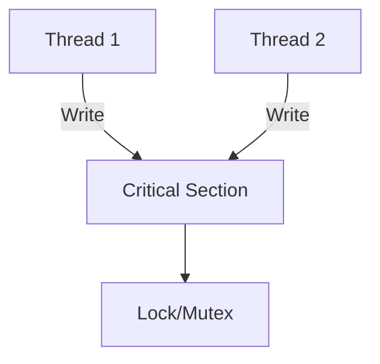

Low level analysis of multi-threading code often deals with how is actually executed. 

# Synchronization Strategies
When two threads share the same data dependency to write, they might overwrite each other's progress at the same time. They have what is called a **race condition**.

Code that handles thread-sensitive information are called **Critical Sections**.



Outline sections within the code where task synchronization is necessary in order to solve a problem.

Say we want to increment a number. Here's sample problem to reason about

```cpp
#include <iostream>
#include <thread>
#include <vector>
#include <mutex>

int counter = 0; // shared resource

void increment_thread(){
	// Thread to handle writing
}

int main() {
    std::vector<std::thread> threads;
    for (int i = 0; i < 10; i++) {
        threads.emplace_back(increment);
    }
    for (auto& t : threads) t.join();

    std::cout << "Final counter = " << counter << std::endl;
}
```

Before:
```cpp
void increment_thread() {
    for (int i = 0; i < 1000; i++) {
	    // critical section (not protected!)
        counter++; 
    }
}
```

Here, the critical section is incrementing the counter. You must safe guard this with some task synchronization.

After:
```cpp
std::mutex mtx;  // synchronization object

void increment() {
    for (int i = 0; i < 1000; i++) {
	    // enter critical section
        std::lock_guard<std::mutex> lock(mtx); 
        counter++; // safe update
    }
}
```

Here, by using a a mutex, one thread can acquire the exclusive right to write while other threads are forced to wait. The mutex is released once the lock guard goes out of scope.

# Interthread communication

Some threads require some sort of way to pass data or functionality to each other. The nature of your data may determine what kind of interthread communication to. 

- **Callbacks** → async file read triggers callback.
- **Message Passing** → thread sends data over queue.
- **Event-based** → thread waits for condition variable to be signaled.

# Memory Sharing and Data Design
Threads may use data in order to execute a process, but be careful, updating data may introduce **race conditions**. 

- **Atomic Variables** - makes data guranteed to update inside caches.
- **Immutable data** - make data use global read-only data.
- **Partitioning** - partition space for each space to write for itself
- **Concurrent Data Structures** - thread-safe data structures allows threads to share memory and information.

# Error Handling

Threading bugs are subtle, but you can design with recovery in mind:

- Use timeouts just in case a thread consumes a resource for too long (To avoid indefinite blocking) 
- Add some **logging** and **tracing** capabilities with the **Thread ID** to locate the bug.
- Design with use of Thread-safe Data Structures to prevent bugs. 

```cpp
if (!lock.try_lock_for(std::chrono::seconds(2))) {
    std::cerr << "Thread " << std::this_thread::get_id() << " timeout\n";
}
```

## Logging

By analyzing the thread execution time, you can optimize the number of threads needed.

### Instrumented Timing
You can set timers of how time a thread accesses the IO.

```cpp
auto start = std::chrono::high_resolution_clock::now();

// Simulate compute
doComputation();

auto mid = std::chrono::high_resolution_clock::now();

// Simulate IO or blocking
doIO();

auto end = std::chrono::high_resolution_clock::now();

auto computeTime = std::chrono::duration_cast<std::chrono::microseconds>(mid - start).count();
auto waitTime    = std::chrono::duration_cast<std::chrono::microseconds>(end - mid).count();

```

This works for simple threads but gets complicated if there are multiple interleaving IO and computer time.

### System profiling

Use OS-level profilers that can distinguish **running vs waiting** states.

- **Linux** (`perf`, `strace`, `top`, `pidstat`, `iostat`):
    - “%CPU” → high means compute-bound.
    - High syscall wait times → IO-bound.
- **Windows** (`Performance Monitor` / `ETW` / `Visual Studio Profiler`):
    - CPU Usage graphs.
    - Context switches and wait reasons.
- **Java** (`JFR`, `JVisualVM`) or **.NET** (`PerfView`, `dotTrace`) give fine-grained breakdown of time in `GC`, blocking, or user code.

### Thread inspection

At runtime, threads can be programmed to have explicit detectable states similar to thread states.

- **RUNNING** (on CPU).    
- **WAITING** (waiting on lock, condition).
- **BLOCKED** (system IO).
    
By sampling thread states (e.g., every few ms), you can statistically estimate wait vs compute proportions. 

Probably one of the most practical by far as even if it requires a bit of set-up, it fairs up well with complicated interleaving processes.