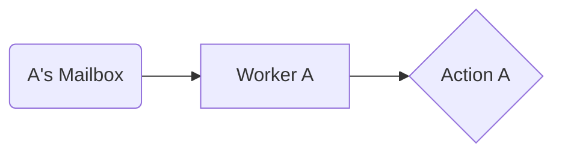
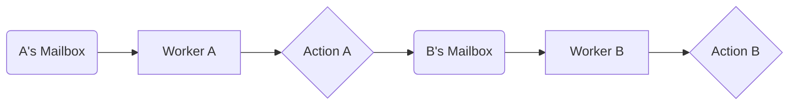

Each "actor" is an independent entity that processes messages sequentially. 



In this system, actors do not share states, but they can communicate with message parsing.



- Each actor has a fandom mailbox (queue) for incoming messages.
- Actors process their own message at a time.
- Actors can create new actors on their own whenever necessary.
- Actors only send messages that are local and known to them - their own social space.

**Benefits**: Eliminates race conditions, makes systems more fault-tolerant (if one actor crashes, others continue).

> [!example] Chat Application
> ```mermaid
> graph LR
>	AM_UserA[A's Mailbox<br/>+ Thread] --> AM_Message[Send<br/>Message]
>	AM_Message --> AM_UserB[B's Mailbox<br/>+ Thread]
>	AM_UserB --> AM_Display{Update<br/>Chat UI}
>	AM_UserC[C's Mailbox<br/>+ Thread] --> AM_Broadcast[Broadcast<br/>Message]
>	AM_Broadcast --> AM_UserA
>	AM_Broadcast --> AM_UserB
> ```

The actor here are individual active users in a messaging application.

# Design Considerations:

## Choosing 
Ask yourself this when choosing the design pattern:
- Do you have **independent** entities that maintain their **own** state?
- Can your problem be modeled as message-passing between entities?
- Do you need **fault isolation** (one failure shouldn't crash everything)?
- Do you need to **avoid** shared mutable state entirely?

## Building Outline
Ask yourself this when building this pattern.
### Actor Design:
- What state does each actor maintain?
- What messages can each actor receive and send?
- How do actors discover and communicate with each other?
- What's the actor life-cycle (creation, supervision, termination)?

### Message Design:
- Are messages immutable?
- What's the message serialization strategy?
- How large can messages be?
- Do you need message ordering guarantees?
- What's your message delivery semantics (at-most-once, at-least-once, exactly-once)?

### Mailbox Management:
- What's the mailbox size limit per actor?
- What happens when a mailbox overflows?
- Do you need message priorities?
- How do you handle slow actors?

### Supervision Strategy:
- What happens when an actor crashes?
- Who supervises which actors?
- What's your restart strategy (one-for-one, all-for-one)?
- How do you handle cascading failures?

### Scaling:
- How do you distribute actors across multiple machines?
- Can actors be dynamically created and destroyed?
- How do you handle actor migration?