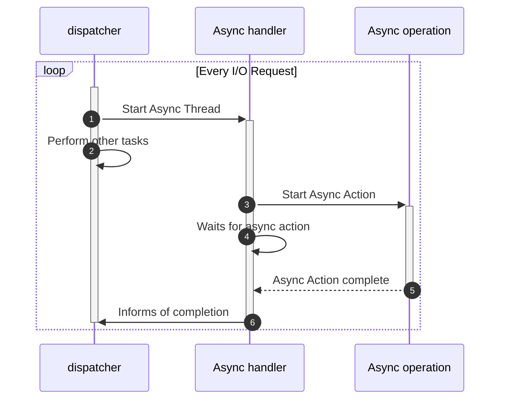

Assigns threads to asynchronous (mostly waiting) events

A single thread, the dispatcher, assign asynchronous threads a task to handle and wait for an asynchronous task to complete. Assigns another task once the interaction is complete.




The difference of this with [[Reactor Pattern]] is that the worker threads sleeps and waits for the async operation to finish, instead of actively processing the data.

Because of this, the shift in the design thought is in making sure that the worker thread is actively working.

**Benefits**: Better for CPU-intensive operations mixed with I/O.

>[!example] Proactor Pattern - Windows IOCP
>```mermaid
>sequenceDiagram
>	autonumber
>	actor User
>	participant dispatcher
>	participant I/O handler
>	participant async operation
>	participant completion
>	User ->>+ dispatcher: Starts Program
>	loop Every I/O Request
>	dispatcher ->>+ I/O handler: Start Async Thread
>	dispatcher -->> dispatcher: Perform other tasks
>	I/O handler ->>+ async operation: Start Async Action
>	I/O handler ->> I/O handler: Waits for async action
>	async operation -->>- I/O handler: Async Action complete
>	I/O handler ->>- dispatcher: Informs of completion
>	dispatcher ->>- completion:  Assigns completion handler
>	end
>	
>	
>```

An example would be I/O Operations in Windows. The dispatcher thread waits for an I/O handler to finish.  

# Design Considerations

## When to Use
- Do you have long-running I/O operations that can run asynchronously?
- Can your platform efficiently support asynchronous I/O completion notifications?
- Do you need to mix CPU-intensive work with I/O operations?
- Are you dealing with operations where completion time is highly variable?
- Do you want to maximize CPU utilization while I/O operations are running?

## Building Outline
### Async Operation Management
- What operations can be made truly asynchronous?
- How do you track outstanding operations?
- What's your completion callback strategy?
- How do you handle operation cancellation?

### Resource Management
- How many concurrent operations can your system handle?
- What's your buffer management strategy for async operations?
- How do you prevent resource exhaustion?
- What's your cleanup strategy for failed operations?
### Error Handling
- How do you handle partial completions?
- What's your retry strategy for failed operations?
- How do you propagate errors from async operations?
- What happens if completion handlers fail?

### Platform Considerations
- Does your platform efficiently support async I/O? (Linux: io_uring, Windows: IOCP)
- What's your fallback strategy for platforms without good async support?
- How do you handle platform-specific completion semantics?