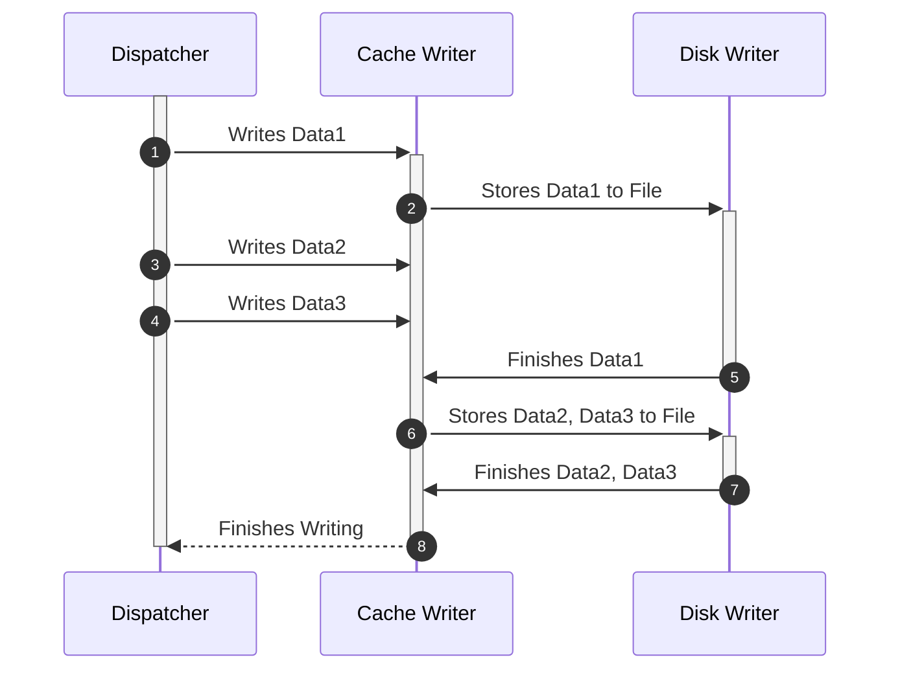
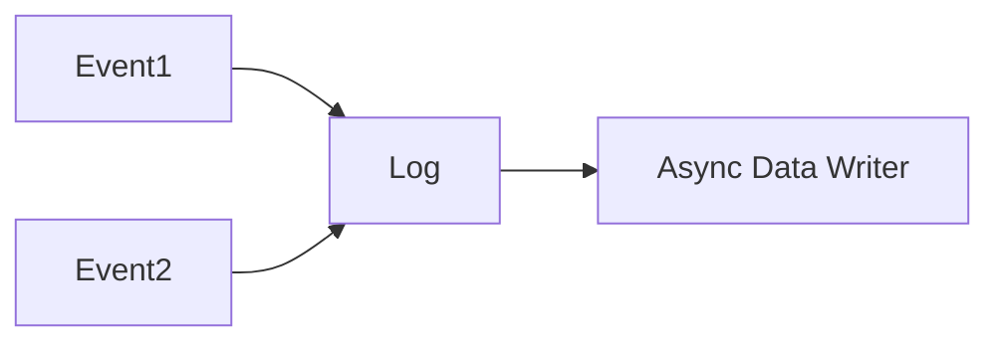

# When to use:
- **< 10 files, < 100 writes/second**: Direct writing is fine
- **Multiple files, 100-1000 writes/second**: Simple queue-based approach
- **1000+ writes/second**:
	- **High frequency writes to same files**: Write-behind caching
	- **Sequence-dependent data**: Write-Ahead Logging

# Design Patterns
Involve storing data in a temporary format now, and do the writing operation later.

## **Write-Behind (Write-Back) Caching**

Writes go to fast storage (RAM) first, then asynchronously flush to slower persistent storage.

**How it works**:
- Writes hit an in-memory cache/buffer first (fast response)
- Background threads batch and flush to disk/database
- Reads check cache first, then persistent storage if needed

>Redis with AOF (Append Only File) - writes are immediately added to memory and logged, then periodically flushed to disk.

**Benefits**: Low write latency, can batch writes for efficiency.

## **Write-Ahead Logging (WAL)**
Log the write operation first, then apply it to the main writing structure.

**How it works**:
- Write operation is logged to append-only log first
- Log write is synchronous (durability guarantee)
- Actual data structure update happens asynchronously.
- Recovery replays the log

Great for Sequential Data such as Tasks. Critical data when each entry needs to be keep track. User Configuration for easy replayability or reversibility.

**Real-world example**: PostgreSQL WAL - every change is logged before being applied to data pages.

**Benefits**: Durability with good performance, enables recovery.