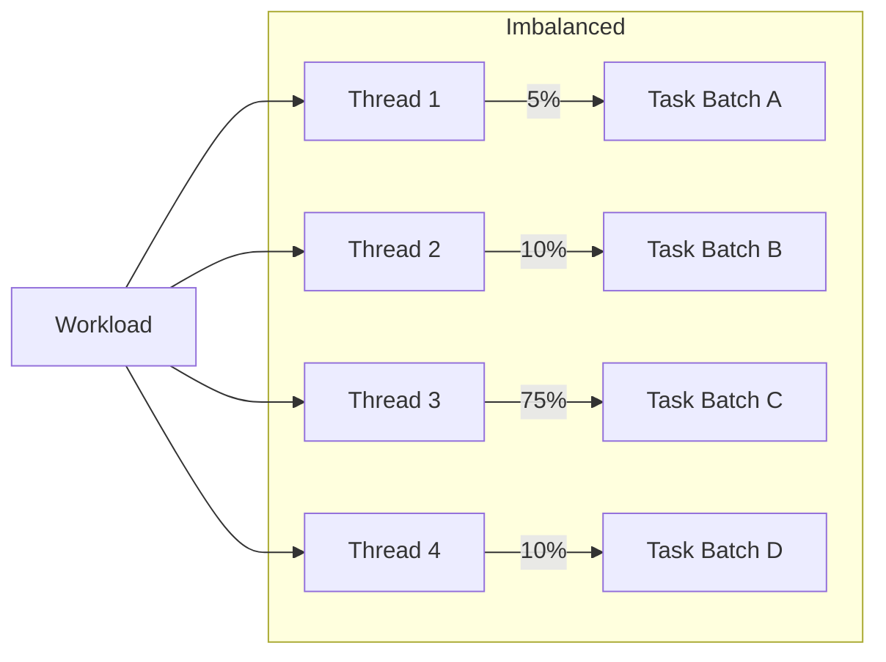
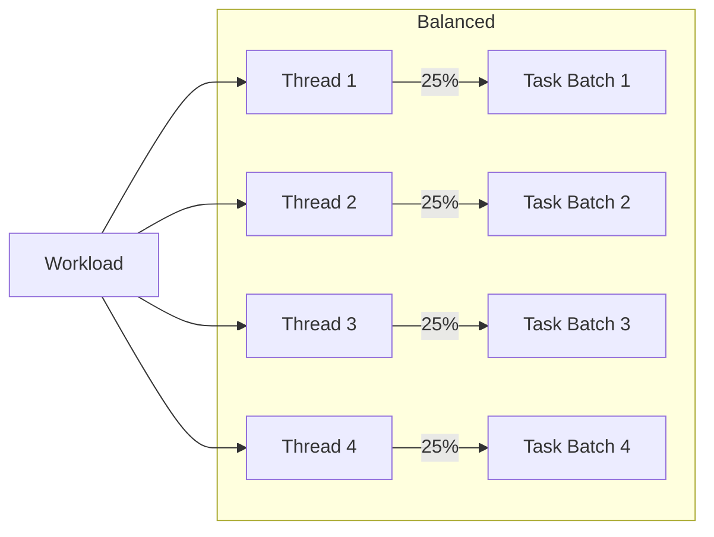
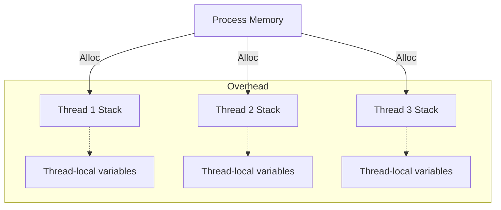
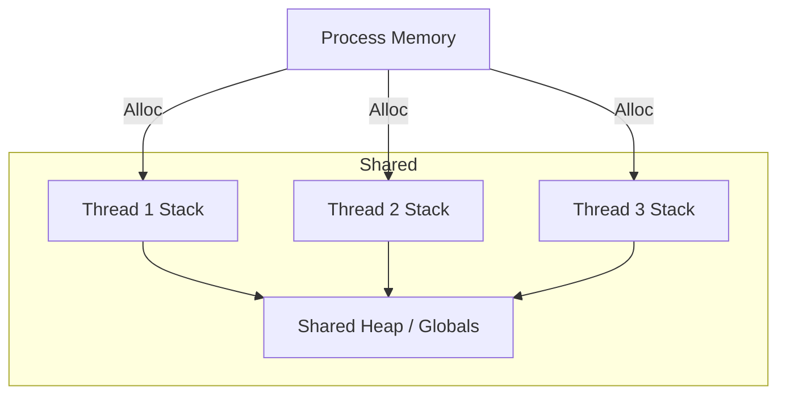
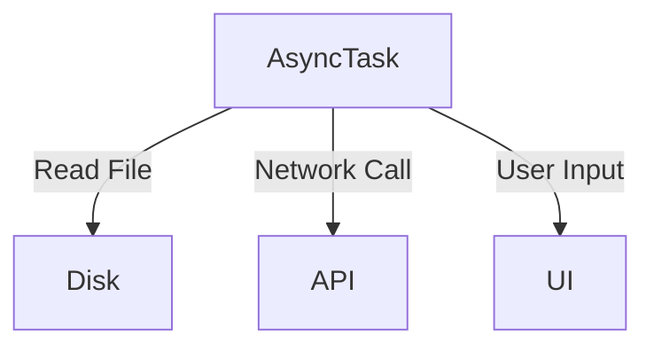

Designed multi-threading solutions may scale off based on the severity of the problem. Scaling is never infinite — it is constrained by **hardware resources**, **workload characteristics**, and **synchronization overheads**.

## Workload Distribution

Workload can be unevenly distributed.

When assigning threads with work, make sure to:
- **Balance the load**: unevenly distributed tasks cause idle cores while others work longer.
- **Avoid fragmentation**: very small tasks can overwhelm the scheduler with overhead.
- **Consider locality**: threads working on data close in memory (cache-friendly) perform better than scattered access.

After balancing:

**Common strategies**:
- **Static partitioning** – divide work evenly at the start.
- **Dynamic scheduling / work stealing** – idle threads grab remaining tasks.
- **Batching** – group small tasks into larger chunks to reduce scheduling overhead.

## Thread Pool Size

When delegating threads, make sure to monitor how many threads are being executed. 

Depending on the number of threads:
- Too many, threads slow down because of **context-switching** overhead
- Too little, CPU resources is under utilized.

The Goal is too **saturate** the CPU with Compute Time.

A rule of thumb for the optimal use of threads:
- \# of CPU-intensive Threads = \# of Cores in Computer
- \# of IO-intensive Threads = 2 \* \# of Cores in Computer

> [!Example]
> If you have an eight-core computer, then the optimal thread size for a high-level task is eight.

IO-intensive threads often *wait* a lot for the *asynchronous* task. A common heuristic for **arrival rate** of a thread is two, but can be refined further with Little's Law.

### Little's Law
This law is common for processes relating to production and can be applied here.
$$
L = \lambda \times W
$$

| Little’s Law Term                     | Analogy in Thread Pools                                               |
| ------------------------------------- | --------------------------------------------------------------------- |
| $L$ (avg # of items in system)        | **# of concurrent threads** (pool size)                               |
| $\lambda$ (arrival rate / throughput) | **Throughput of tasks per second** (how many tasks finish per second) |
| $W$ (time in system)                  | **Task execution time** (compute time + wait time)                    |
Since we do not know the **throughput** rate without doing posteriori analysis, we can do some priori analysis given the facts that we know.

We can directly compute it with the fact that *each core uses a thread*. 

However, some threads may have waiting time. We need another thread working while the other sleeps. We need to **oversubscribe**.

Oversubscription - scale factor for threads to account for the waiting factor, and it is  computed as $O = \frac{W}{C}$

### Thread Saturation Equation
$$
\text{Thread Pool Size} \approx \text{\#cores} \times \frac{W}{C}.
$$

Execution Time depends on the **nature** of the task.

**CPU-Bound**

The threads does very little waiting, so Total Execution Time is:
$$T = \text{compute time}$$

**IO-Bound**
The threads needs to wait for the asynchronous process, Total Execution time $W$:
$$T = \text{compute time} + \text{wait time}$$

> [!example]
> Given an 8-core machine. Tasks take **100 ms total**, but **90 ms waiting on IO** and only **10 ms computing**.
> $$O =\frac{Wait}{Compute} = \frac{90}{10} = 9$$

So:
$$
\text{Thread Pool Size} \approx 8 \times (1 + 9) = 80
$$

Meaning: you might run **~80 threads** for this IO-heavy workload to saturate the CPU.

## Memory Usage

Each thread requires its own **stack space** and incurs overhead for synchronization structures (mutexes, condition variables).

Here what it looks likes with out memory optimization

- More threads = more memory pressure → risk of cache thrashing or hitting memory bandwidth limits.    
- Thread-local data can reduce **contention**, but duplicates memory.
- False sharing (different threads modifying nearby variables in the same cache line) can drastically hurt performance.

**Common methods to optimize**:
- Use **shared global data** where possible, with synchronization.
- Reduce thread stack size if the default is too large for thousands of threads.
- Consider **thread pools** instead of spawning threads dynamically.
- Apply **lock-free data structures** to reduce contention.

Once done optimizing, an application may look  like this.

## IO Usage

Reading and write multiple files, user inputs, and other IO devices, may slow down the speed of your program.

Threads that are assigned these can be marked as asynchronous, and may require specific thread patterns.

You can *log* the time for IO Usage seen in [[Low Level Analysis]].

Keep in mind, some processes **cannot** be scaled. User Input and Network API calls for example are limited to the User's Interaction and the API Limit Rate.

In this case, multi-threading is **insufficient** and may require unique methods to bypass them.

**Bypasses / Mitigations**:
- Cache results to avoid repeated calls.
- Use **default user responses** or timeouts for unresponsive input.    
- Upgrade to **premium API accounts** or use batching to reduce overhead.
- Apply **IO multiplexing** for high concurrency.

## ## Synchronization Overhead

Another critical scalability factor is how threads coordinate. Even with perfect workload distribution and enough memory:
- **Locks and barriers** reduce effective concurrency.
- Contention on shared data structures grows with thread count.
- Atomic operations scale better than locks but still introduce serialization.

**Thread contention** is the time threads have to wait during thread contention. Thus, waiting time can increase with more task synchronization.

**Rule of thumb**:
> The more synchronization a workload requires, the less it benefits from adding threads.

