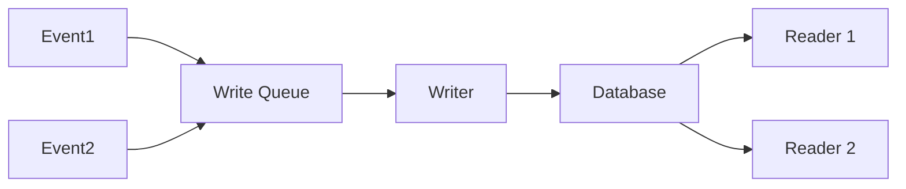

Separate the responsibilities of write model (commands) from the read model (queries).


- Commands modify state (writes) - use single-threaded or carefully synchronized
- Queries read state (reads) - can be highly parallel.
- Often combined with the [[Event Sourcing Pattern]]

**Benefits**: Optimizes reads and writes separately, scales better under different load patterns.

>[!example] E-commerce
>```mermaid
>graph LR
>	CQRS_Update[Product Update<br/>Command] --> CQRS_CommandHandler[Command Handler<br/>Single Thread]
>	CQRS_CommandHandler --> CQRS_WriteDB[Write Database]
>	CQRS_WriteDB --> CQRS_Sync[Sync Process]
>	CQRS_Sync --> CQRS_ReadReplica1[Read Replica 1]
>	CQRS_Sync --> CQRS_ReadReplica2[Read Replica 2]
>	CQRS_Sync --> CQRS_ReadReplica3[Read Replica 3]
>	CQRS_Search1[Product Search<br/>Query Thread 1] --> CQRS_ReadReplica1
>	CQRS_Search2[Product Search<br/>Query Thread 2] --> CQRS_ReadReplica2
>	CQRS_Search3[Product Search<br/>Query Thread 3] --> CQRS_ReadReplica3
>	CQRS_ReadReplica1 --> CQRS_Result1[Search Results 1]
>	CQRS_ReadReplica2 --> CQRS_Result2[Search Results 2]
>	CQRS_ReadReplica3 --> CQRS_Result3[Search Results 3]
>```

**Real-world example**: 
E-commerce site where product updates (commands) go through a single-threaded validation pipeline, but product searches (queries) are served by multiple read-only replicas.


# Design Considerations

## Choosing
Ask yourself this when choosing this system:
- Do you have very different read and write patterns?
- Are your read queries complex and numerous compared to writes?
- Do you need to scale reads and writes independently?
- Do you have multiple different views of the same data?
- Are your write operations complex business workflows?
- Do you need different consistency guarantees for reads vs writes?
## Building
**Command Side Design:**
- How do you model and validate commands?
- What's your command processing workflow?
- Do you need command queuing and async processing?
- How do you handle command failures and compensation?
- What's your transaction and consistency strategy?

**Query Side Design:**

- What read models do you need?
- How do you optimize each read model for its specific queries?
- Can read models be eventually consistent?
- How do you handle read model rebuilding?
- What's your caching strategy for read models?

**Synchronization:**
- How do you keep read models synchronized with writes?
- What's your acceptable lag between writes and read visibility?
- How do you handle synchronization failures?
- Do you need real-time updates for some read models?

**Data Consistency:**
- What consistency level do you need? (strong, eventual, session)
- How do you handle read-your-own-writes scenarios?
- What's your conflict resolution strategy?
- How do you handle partial failures in synchronization?

**Multi-threading Considerations:**
- Can multiple threads safely process commands?
- How do you handle concurrent updates to read models?
- What's your strategy for scaling command processors?
- How do you handle read model update ordering?

**Operational Considerations:**
- How do you monitor and debug a CQRS system?
- What's your deployment strategy for schema changes?
- How do you handle data migrations?
- What's your backup and disaster recovery strategy?