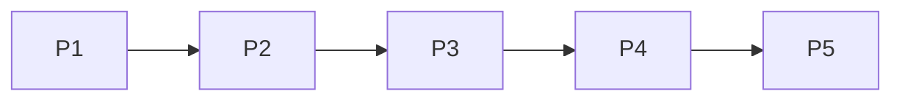

Also known as the **Chain of Responsibility Pattern**

Data flows through multiple stages, with each stage processed by different threads.
- Each stage can run in parallel on different data
- Like an assembly line



Each stage is **dependent** on the previous for input, but are complete **independent** in terms of process execution.

**Benefits**: High throughput, natural parallelism, easy to reason about.

# Real-world example
An example would be video processing, data modelling pipelines.

> [!example] Video Processing
> ```mermaid
> graph TB
> 	subgraph Assembly Line
> 	PP_Input[Video Input] --> PP_Stage1[Stage 1: Decode Thread 1] 
> 	PP_Stage1 --> PP_Buffer1[Buffer] 
> 	PP_Buffer1 --> PP_Stage2[Stage 2: Filter Thread 2] 
> 	PP_Stage2 --> PP_Buffer2[Buffer] 
> 	PP_Buffer2 --> PP_Stage3[Stage 3: Encode Thread 3] 
> 	PP_Stage3 --> PP_Output[Video Output] 
> 	end
> 	PP_Frame1[Frame 102] --> PP_Stage1 
> 	PP_Frame2[Frame 101] --> PP_Stage2 
> 	PP_Frame3[Frame 100] --> PP_Stage3
> ```

- Video processing pipeline where:
	- Stage 1 decodes frames, 
	- Stage 2 applies filters, 
	- Stage 3 encodes output. 
While Stage 3 encodes frame 100, Stage 2 filters frame 101, and Stage 1 decodes frame 102.

# Design Considerations

## Choosing
Ask yourself this when choosing the design pattern
- Can your processing be broken into distinct, sequential stages?
- Do different stages have different processing times or resource requirements?
- Can stages process different items concurrently?
- Do you need high throughput for stream processing?
- Are the processing stages naturally independent?

## Building Outline

**Stage Design:**
- How do you divide processing into stages?
- What's the optimal granularity for each stage?
- Can stages be reordered or parallelized?
- How do you handle stages with different processing speeds?

**Buffer Management:**
- What's the buffer size between stages?
- How do you handle back pressure when downstream stages are slow?
- Do you need flow control between stages?
- What's your strategy for handling buffer overflows?

**Error Handling:**
- What happens when one stage fails?
- Do you need to process items in strict order?
- How do you handle partial processing failures?
- What's your retry and recovery strategy?

**Scaling:**
- Can you run multiple instances of the same stage in parallel?
- How do you dynamically scale stages based on load?
- What's your strategy for handling varying stage complexities?
- How do you re-balance processing when adding/removing stage instances?

**Monitoring:**
- How do you measure throughput at each stage?
- What metrics indicate bottlenecks?
- How do you detect and handle stalled pipelines?